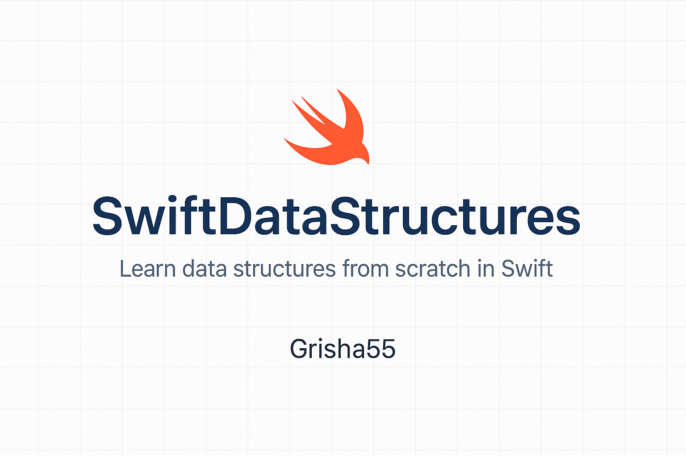

<p align="center">
  
</p>

# 📦 SwiftDataStructures


> **Hand-crafted data structures in Swift** — Learn how arrays, stacks, queues, linked lists, trees, and more work under the hood.

---

## 📘 Overview

This repository contains educational implementations of classic data structures in Swift, written from scratch for a deeper understanding of how they actually work behind the scenes.  
Each structure is documented and commented to help you learn, practice, and build a strong foundation in computer science.

---

## 🧠 What’s Inside

- 📂 `DynamicArray.swift` – A growable array with manual resizing
- 📂 `Stack.swift` – LIFO stack using array
- 📂 `Queue.swift` – FIFO queue with two stacks
- 📂 `LinkedList.swift` – Singly and doubly linked lists
- 📂 `BinaryTree.swift` – Binary tree with traversal methods
- 📂 `HashTable.swift` – Basic hash table with collision handling
- 📂 `Graph.swift` – Graph structure with DFS and BFS
- 📂 `Heap.swift` – Min-heap / max-heap implementation

---

## 🎯 Purpose

This repository is great for:

- Learning data structures through hands-on coding
- Preparing for technical interviews (especially for Swift/iOS devs)
- Building strong CS fundamentals
- Understanding what's behind `Array`, `Set`, `Dictionary`, etc.

---

## 🧰 Requirements

- Swift 5.0+
- Xcode (optional, for playgrounds or testing)

---

## 🚀 Getting Started

Clone the repo:

```bash
git clone https://github.com/your-username/SwiftDataStructures.git
cd SwiftDataStructures

---

Made with ❤️ by Grisha55

---
## 🤝 Contributions
Contributions, improvements, and feedback are welcome!
Feel free to open issues or submit pull requests.


